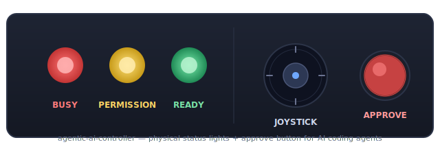

# agentic-ai-controller

Physical status lights + approve button for [Claude Code](https://claude.com/claude-code).

Turn an Arduino Uno, three LEDs, a button and a joystick into a dedicated console for AI agents: glance at your desk to know whether your agent is working, waiting on you, or done — and approve permission prompts without leaving whatever you're doing.

<p align="center">
  
</p>

## What it does

| LED | Meaning | Fired by hook |
|---|---|---|
| 🔴 **Red** | Busy — agent is thinking or running a tool | `UserPromptSubmit`, `PreToolUse`, `PostToolUse` |
| 🟡 **Yellow** | Permission — agent is waiting for your approval | `PermissionRequest` |
| 🟢 **Green** | Ready — turn is finished | `Stop` |

And physical input:

| Control | Sends | Use for |
|---|---|---|
| Big button | <kbd>Enter</kbd> | Approve the highlighted choice in a permission prompt |
| Joystick ↑ | <kbd>↑</kbd> | Navigate up in the permission dialog |
| Joystick ↓ | <kbd>↓</kbd> | Navigate down in the permission dialog |
| Joystick press | <kbd>Enter</kbd> | Secondary approve |

## How it works

```
┌──────────────┐  USB-serial   ┌───────────────┐  HTTP hooks  ┌──────────────┐
│  Arduino Uno │◀─────────────▶│ Python bridge │◀─────────────│  Claude Code │
│  LEDs + btn  │   9600 baud   │  (this repo)  │  127.0.0.1   │              │
└──────────────┘               └───────────────┘              └──────────────┘
                                       │
                                       ▼  pynput keystrokes
                               ┌───────────────┐
                               │  Your terminal │
                               │  (frontmost)   │
                               └───────────────┘
```

1. **Hooks** in `~/.claude/settings.json` `curl` the bridge on every event Claude Code fires.
2. **The bridge** owns the serial port, translates HTTP → single-byte commands to the Arduino, and reads button/joystick events back from the Arduino.
3. **The Arduino** drives the LEDs and debounces the input hardware.
4. When you press the button, the bridge uses [`pynput`](https://pypi.org/project/pynput/) to post an <kbd>Enter</kbd> keystroke to whichever window has focus.

## Hardware — bill of materials

| Qty | Part | Notes |
|----:|------|-------|
| 1 | Arduino Uno (R3 or R4) | Any USB-serial board will work with minor pin changes. |
| 1 | Red, 1 yellow, 1 green 5 mm LED | Standard through-hole. |
| 3 | 220 Ω resistors | One per LED (bands: red-red-brown). |
| 1 | Momentary push-button | The "approve" button. Bigger = more satisfying. |
| 1 | 2-axis joystick module | KY-023-style, with `VCC / GND / VRx / VRy / SW`. |
| 1 | Breadboard | Half-size or larger. |
| ~12 | Jumper wires | Mostly M-to-M; M-to-F if your joystick has pin headers. |
| 1 | USB cable | To connect the Arduino to your machine. |

**Full wiring diagram and breadboard-order assembly:** [`docs/hardware_setup.html`](docs/hardware_setup.html) (open in a browser).

### Pinout quick reference

| Arduino pin | Connects to | Function |
|---|---|---|
| `D9` | Red LED anode → 220 Ω → GND | Busy |
| `D10` | Yellow LED anode → 220 Ω → GND | Permission |
| `D11` | Green LED anode → 220 Ω → GND | Ready |
| `D2` | Button → GND | Approve |
| `D3` | Joystick `SW` | Joystick press (secondary approve) |
| `A0` | Joystick `VRy` | Up / down |
| `5V` | Joystick `VCC` | — |
| `GND` | Joystick `GND`, LED cathodes, button | Common ground |

## Software requirements

- Python 3.9+
- [`pyserial`](https://pypi.org/project/pyserial/), [`pynput`](https://pypi.org/project/pynput/) (installed automatically by `install.sh`)
- Arduino IDE 1.8+ or [`arduino-cli`](https://arduino.github.io/arduino-cli/) to upload the sketch
- macOS, Linux, or Windows. macOS additionally requires **Accessibility** permission for the terminal running the bridge (one-time prompt).

## Install

### 1. Clone the repo

```bash
git clone https://github.com/YOUR-USERNAME/agentic-ai-controller.git
cd agentic-ai-controller
```

### 2. Wire the hardware

Follow [`docs/hardware_setup.html`](docs/hardware_setup.html). It takes about 10 minutes and has breadboard-order instructions with colour-coded diagrams.

### 3. Upload the sketch

Open `arduino/agentic_ai_controller/agentic_ai_controller.ino` in the Arduino IDE, pick **Arduino Uno** as the board, and click **Upload**. On power-up you should see all three LEDs cycle once, then green stays on.

### 4. Run the installer

```bash
./install/install.sh
```

This will:

- `pip install -r bridge/requirements.txt`
- Merge five LED hooks into `~/.claude/settings.json` — existing hooks (sounds, other custom hooks) are preserved; your file is backed up before any change.
- Optionally install an auto-start service (launchd on macOS, systemd user-unit on Linux) so the bridge comes up at login.

### 5. Reload hooks in Claude Code

In an open Claude Code session, run `/hooks` once — or restart `claude` — so the new hooks are picked up.

### 6. macOS only: grant Accessibility

When you press the button for the first time, macOS will prompt for Accessibility access. Toggle on the terminal (or `launchd`) process running the bridge, then restart it.

## Usage

Once installed, the bridge auto-starts at login. Just use Claude Code as normal — the LEDs reflect state, and the button/joystick act on permission prompts.

### Manual bridge control

```bash
# Start in foreground with debug logs
python3 bridge/agentic_ai_bridge.py --log-level DEBUG

# Use a specific serial port and HTTP port
python3 bridge/agentic_ai_bridge.py --port /dev/cu.usbmodem1101 --http-port 9000

# List detected serial ports and exit
python3 bridge/agentic_ai_bridge.py --list-ports

# See all flags
python3 bridge/agentic_ai_bridge.py --help
```

### Managing the background service

**macOS (launchd)**
```bash
launchctl unload ~/Library/LaunchAgents/com.agenticai.controller.plist
launchctl load   ~/Library/LaunchAgents/com.agenticai.controller.plist
tail -f ~/Library/Logs/agentic-ai-controller/bridge.err.log
```

**Linux (systemd user)**
```bash
systemctl --user restart agentic-ai-controller
systemctl --user status  agentic-ai-controller
journalctl  --user -u agentic-ai-controller -f
```

### Sanity-check the HTTP API

```bash
curl http://127.0.0.1:8787/healthz       # {"ok":true,"version":"1.0.0","port":"/dev/..."}
curl http://127.0.0.1:8787/led/test      # cycles all three LEDs
curl http://127.0.0.1:8787/led/red
curl http://127.0.0.1:8787/led/yellow
curl http://127.0.0.1:8787/led/green
curl http://127.0.0.1:8787/led/off
```

## Configuration

The bridge reads an optional JSON config file passed via `--config`:

```bash
cp bridge/config.example.json bridge/config.json
# edit bridge/config.json
python3 bridge/agentic_ai_bridge.py --config bridge/config.json
```

Keys (all optional; missing keys fall back to defaults):

| Key | Default | Description |
|---|---|---|
| `port` | `null` (auto) | Serial device path. Override if the auto-detector picks the wrong one. |
| `baud` | `9600` | Must match the Arduino sketch. |
| `http_host` | `127.0.0.1` | Binds loopback-only by design. |
| `http_port` | `8787` | Used both by the HTTP server and by the hook URLs. |
| `reconnect_delay_s` | `2.0` | Time between reconnect attempts when the Arduino is unplugged. |
| `boot_test` | `true` | Cycle LEDs once on startup. |
| `keys.approve` | `"enter"` | Key sent when the button is pressed. |
| `keys.up` / `keys.down` | `"up"` / `"down"` | Keys sent on joystick. |

If you change `http_port` you must run `./install/install.sh --port NEW_PORT` so the hooks target the right URL.

### Custom keybindings

The `keys.*` fields accept either a special-key name (`enter`, `esc`, `tab`, `space`, arrow keys, `page_up`, `page_down`, `home`, `end`, `backspace`) or a single literal character. So you can bind the button to `y` to answer yes in y/n dialogs, or the joystick to `j` / `k` to use vim-style navigation.

## Uninstall

```bash
./install/uninstall.sh
```

This removes **only** the hooks it owns (identified by the `127.0.0.1:PORT/led/` URL marker), unloads the auto-start service, and leaves every other hook and setting in your `settings.json` untouched.

## Troubleshooting

| Symptom | Likely cause | Fix |
|---|---|---|
| LEDs don't light at all on boot | LED wired backwards or no resistor | Long leg → Arduino pin (via resistor); short leg → GND. |
| `no serial device matching ...` | Arduino not plugged in, or Serial Monitor is hogging the port | Close Arduino IDE's Serial Monitor, re-run the bridge. |
| Bridge runs but LEDs don't react to Claude | Hooks not reloaded, or wrong port | Run `/hooks` in Claude once, and confirm `curl http://127.0.0.1:8787/led/red` flips the LED. |
| Bridge logs `BTN -> ok` but Claude doesn't accept | macOS Accessibility, or focus | Grant Accessibility to the terminal running the bridge; click into the Claude window before pressing. |
| Yellow stays on after approving | Old config — fixed in v1.0.0 | Re-run `./install/install.sh`; it re-merges the `PostToolUse` hook that clears yellow → red. |
| Joystick drifts | Module center isn't exactly 512 | Edit `JOY_CENTER_LO` / `JOY_CENTER_HI` in `arduino/agentic_ai_controller/agentic_ai_controller.ino`, widen to 380/640, re-upload. |

Full troubleshooting section is in [`docs/hardware_setup.html`](docs/hardware_setup.html) §10.

## Security notes

- The HTTP server binds to `127.0.0.1` only. It accepts no input from the network.
- The bridge posts keystrokes only on Arduino-originated events (`BTN`, `UP`, `DN`). The HTTP API cannot inject keystrokes.
- `hooks_merge.py` writes atomically (temp-file + `os.replace`) and backs up `settings.json` before every change.
- Serial access on Linux usually requires membership in the `dialout` (Debian/Ubuntu) or `uucp` (Arch) group. Add yourself and log out/in:
  ```bash
  sudo usermod -aG dialout "$USER"
  ```

## Project layout

```
agentic-ai-controller/
├── arduino/agentic_ai_controller/
│   └── agentic_ai_controller.ino      # the firmware
├── bridge/
│   ├── agentic_ai_bridge.py           # the daemon
│   ├── config.example.json
│   └── requirements.txt
├── install/
│   ├── install.sh                     # installer
│   ├── uninstall.sh
│   ├── hooks_merge.py                 # safe settings.json merger
│   ├── com.agenticai.controller.plist.template
│   └── agentic-ai-controller.service.template
├── docs/
│   └── hardware_setup.html
├── README.md
├── LICENSE           (MIT)
├── CONTRIBUTING.md
├── CHANGELOG.md
└── .gitignore
```

## Contributing

Issues and pull requests welcome. See [`CONTRIBUTING.md`](CONTRIBUTING.md) for the full dev loop and project conventions.

## Roadmap

- [ ] Pin-map variants for ESP32, Pro Micro, RP2040
- [ ] Enclosure STLs (3D-printable)
- [ ] Desktop notification on long-running turns
- [ ] Optional OLED status screen instead of 3 LEDs
- [ ] Wayland keystroke path (currently pynput is X11-only on Linux)

## License

[MIT](LICENSE) — free for any use. If you build a cooler version, I'd love to see it.

## Credits

Built on top of:

- [Claude Code](https://claude.com/claude-code) and its [hooks system](https://docs.claude.com/en/docs/claude-code/hooks)
- [pyserial](https://pypi.org/project/pyserial/) — serial I/O
- [pynput](https://pypi.org/project/pynput/) — keyboard injection
